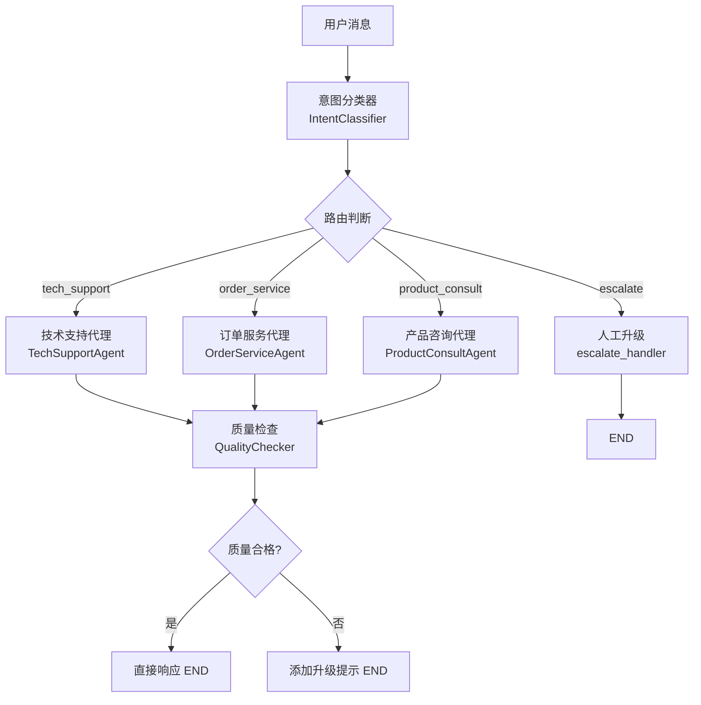

# 多代理客服系统 `main.py` 详细解析

## 整体架构

这个程序实现了一个**智能客服系统**，用户发一条消息，系统自动识别意图，分派给对应的专业 AI 代理来回答，最后还会做质量检查。



---

## 第一层：数据准备（模拟数据库）

**位置：** 第 83–144 行

```python
MOCK_ORDERS = { "ORD001": {...}, "ORD002": {...} }
MOCK_PRODUCTS = { "智能手表 Pro": {...}, ... }
FAQ_DATABASE = { "连接问题": "解决步骤...", ... }
```

**作用：** 模拟真实业务系统的数据库，让 Agent 有数据可查。

---

## 第二层：工具定义（Tools）

**位置：** 第 148–244 行，共 5 个工具

| 工具 | 输入 | 作用 |
|------|------|------|
| `query_order` | 订单号 | 查询订单状态、物流、价格 |
| `track_shipping` | 物流单号 | 查询物流进度 |
| `search_product` | 关键词 | 搜索产品信息 |
| `get_product_recommendations` | 预算、类别 | 推荐产品 |
| `search_faq` | 问题类型 | 搜索常见问题解答 |

**关键点：** 用 `@tool` 装饰器标记，LangChain 会自动把函数签名和 docstring 转成 LLM 能理解的工具描述格式。

---

## 第三层：State（共享数据字典）

**位置：** 第 248–258 行

```python
class CustomerServiceState(TypedDict):
    user_message:      str         # 用户原始消息
    chat_history:      List[...]   # 对话历史
    intent:            str         # 识别出的意图（tech_support/order_service/...）
    confidence:        float       # 意图置信度（0~1）
    agent_response:    str         # 最终回复内容
    needs_escalation:  bool        # 是否需要转人工
    escalation_reason: str         # 转人工的原因
    quality_score:     float       # 质量评分（0~1）
    metadata:          Dict        # 时间戳等附加信息
```

**作用：** 贯穿整个工作流的「共享托盘」，每个节点从这里读数据、往这里写结果。

---

## 第四层：四个 AI 角色

### 1. `IntentClassifier` — 意图分类器（第 262–295 行）

```
用户消息 → prompt → LLM → JSON解析
```

- 用 **LangChain LCEL**：`prompt | llm | StrOutputParser()`
- 让 LLM 判断用户意图属于哪类（技术/订单/产品/升级）
- 返回 `{"intent": "tech_support", "confidence": 0.90}`

### 2. `TechSupportAgent` — 技术支持代理（第 297–333 行）

```
用户问题 → create_agent → 自动调用 search_faq 工具 → 回答
```

- 使用 `create_agent`（LangChain 封装的 ReAct Agent）
- 配备 `search_faq` 工具，Agent 自主决定是否调用工具
- 擅长：连接问题、充电问题、软件更新等

### 3. `OrderServiceAgent` — 订单服务代理（第 335–367 行）

```
用户问题 → create_agent → 自动调用 query_order / track_shipping → 回答
```

- 配备 `query_order` + `track_shipping` 工具
- 擅长：查订单状态、查物流进度

### 4. `ProductConsultAgent` — 产品咨询代理（第 369–402 行）

```
用户问题 → create_agent → 自动调用 search_product / 推荐工具 → 回答
```

- 配备 `search_product` + `get_product_recommendations` 工具
- 擅长：产品功能介绍、根据预算推荐

### 5. `QualityChecker` — 质量检查器（第 404–438 行）

```
(用户问题 + Agent回复) → LLM评分 → {"total_score": 85, "needs_escalation": false}
```

- 从相关性、完整性、专业性、有用性四个维度打分
- 分数低于 60 → 触发升级

---

## 第五层：LangGraph 工作流（核心）

**位置：** 第 456–611 行

### 图结构

```
START
  ↓
classify（意图分类）
  ↓ 条件路由
  ├── tech_support → quality_check
  ├── order_service → quality_check
  ├── product_consult → quality_check
  └── escalate → END
               ↓ 条件路由
quality_check
  ├── 质量合格 → respond → END
  └── 质量不合格 → escalate_final → END
```

### 每个节点的职责

| 节点 | 函数 | 读取 State 字段 | 写入 State 字段 |
|------|------|---------------|---------------|
| `classify` | `classify_intent` | `user_message` | `intent`, `confidence` |
| `tech_support` | `tech_support_handler` | `user_message` | `agent_response` |
| `order_service` | `order_service_handler` | `user_message` | `agent_response` |
| `product_consult` | `product_consult_handler` | `user_message` | `agent_response` |
| `escalate` | `escalate_handler` | — | `needs_escalation`, `agent_response` |
| `quality_check` | `quality_check` | `user_message`, `agent_response` | `quality_score`, `needs_escalation` |
| `escalate_final` | `final_escalate` | `agent_response` | `agent_response`（追加提示） |
| `respond` | `respond` | — | — （直接透传） |

---

## 第六层：入口 `handle_message`

**位置：** 第 613–639 行

```python
def handle_message(self, message: str) -> Dict:
    initial_state = {
        "user_message": message,
        "intent": "",
        "confidence": 0.0,
        # ... 所有字段初始为空
    }
    result = self.graph.invoke(initial_state)  # 整个图跑一遍
    return {
        "response": result["agent_response"],
        "intent": result["intent"],
        "quality_score": result["quality_score"],
        ...
    }
```

---

## 一次完整请求的数据流

以「我的蓝牙耳机连接不上手机」为例：

```
1. handle_message("我的蓝牙耳机连接不上手机")
   └── 初始化 State，调用 graph.invoke()

2. [classify 节点]
   └── LLM 分析 → intent = "tech_support", confidence = 0.90

3. [路由判断] confidence >= 0.6 且 intent == "tech_support"
   └── 跳转到 tech_support 节点

4. [tech_support 节点]
   └── TechSupportAgent.handle("我的蓝牙耳机连接不上手机")
       └── Agent 调用 search_faq("连接问题")
           └── 返回 FAQ 答案 → 生成完整回复

5. [quality_check 节点]
   └── QualityChecker.check(问题, 回复) → score = 0.85

6. [路由判断] score >= 0.6 → 跳转 respond 节点 → END

7. 返回最终结果给用户
```
